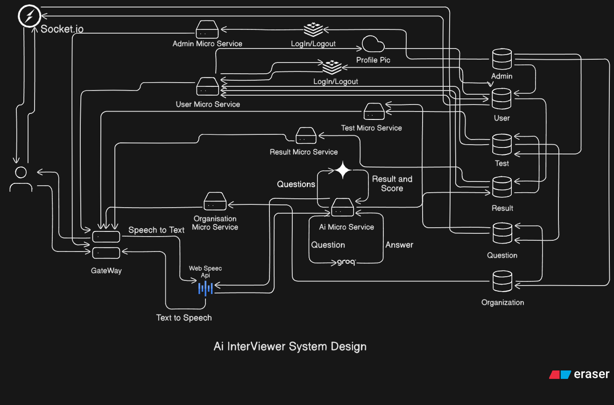

# 🤖 AI Interviewer

AI Interviewer is a **microservice-based interview platform** that enables organizations to conduct automated interviews powered by AI.  
It supports **voice, text, and MCQ interviews** and generates instant results with analytics.

---

## 🖼️ System Design



The system is designed using **microservices**, connected via a **Gateway** and **Socket.IO** for real-time communication.  
- **Web Speech API** handles Speech-to-Text & Text-to-Speech for voice-based interviews.  
- **AI Microservice** integrates **Groq** and **Gemini AI** for intelligent question answering and evaluation.  
- **Result Microservice** handles scoring and reporting.  
- **Organization, User, and Admin Microservices** manage role-specific operations.  
- **Question & Test Microservices** handle question banks and test management.  

---

## ✨ Features
- 🎤 **Voice Interviews** using Web Speech API (Speech-to-Text & Text-to-Speech)  Comming Soon !
- 📝 **MCQ & Text Interviews** with automated evaluation  
- 🧠 **AI-powered evaluation** using **Groq** (fast inference) + **Gemini AI** (contextual understanding)  
- 📊 **Real-time Result Analytics**  
- 🏢 **Organization Dashboard** for test creation & candidate management  
- 👤 **User Dashboard** for attempting interviews & viewing reports  
- 🔑 **Admin Controls** for managing the platform  
- ⚡ **Scalable Microservices Architecture** with dedicated databases  

---

## 🏗️ Tech Stack
**Frontend**
- React.js + Tailwind CSS + Framer Motion  
- Socket.IO Client  
- Axios (for API calls)  
- Web Speech API (for speech recognition & synthesis)  

**Backend (Microservices)**
- Node.js + Express  
- MongoDB (separate DB per service)  
- Socket.IO (real-time communication)  

**AI Layer**
- **Groq** → Fast inference & model execution  
- **Gemini AI** → Conversational understanding & evaluation  
- Web Speech API → Speech-to-Text & Text-to-Speech  

## **Deployment**
- Render (each microservice hosted separately)  

---

## 📂 Microservices Overview
- **Gateway Service** → Main entry point & routing (Socket.IO + REST)
- link : https://github.com/Sc-Designs/Gateway-Of-A.I. 
- **Ai Interviewer Frontend** → User view
- link - https://github.com/Sc-Designs/Ai-Interview-Frontend
- **Admin Microservice** → Manages users & organizations
- link - https://github.com/Sc-Designs/Admin-microService-A.I.
- **Organization Microservice** → Creates/manages tests
- link - https://github.com/Sc-Designs/Organization-microService-A.I. 
- **Test Microservice** → Stores test sets and management & delivery questions
- link - https://github.com/Sc-Designs/Test-MicroService-A.I.
- **AI Microservice** → AI-driven Q&A + evaluation (Groq + Gemini)
- link - https://github.com/Sc-Designs/Ai-microService-A.I.
- **Result Microservice** → Scoring & analytics
- link - https://github.com/Sc-Designs/Result-microService-A.I.

---

## ⚙️ Installation & Setup

### 1️ Clone the repository
```bash
git clone https://github.com/your-username/ai-interviewer.git
cd ai-interviewer
```

###  Setup .env for each microservice


# inside each service
npm install

### Run locally
npm run dev

## 🚀 Usage Flow

 - Organization creates a test set.

 - Candidate joins the interview (text or voice).

 - AI Microservice (Groq + Gemini) generates/responds to questions.

 - Web Speech API converts voice ↔ text.

 - Result Microservice evaluates and stores the score.

 - Admin monitors and manages platform-wide activity.


### 📊 Example Workflow

- Candidate logs in → Gateway routes to User Microservice

- Organization assigns a test → Gateway routes to Test & Question Microservices

- Candidate answers via voice → Web Speech API → AI Microservice (Groq + Gemini) → evaluates

- Result Microservice generates score & report

- Data stored in dedicated service databases

<br />

## 🤝 Contributing

Contributions are always welcome!  

If you have an idea for improvement or find a bug, please open an issue first to discuss what you would like to change.  

### Steps to Contribute
1. Fork the repository  
2. Create a new branch (`git checkout -b feature-branch-name`)  
3. Make your changes  
4. Commit your changes (`git commit -m 'Add some feature'`)  
5. Push to the branch (`git push origin feature-branch-name`)  
6. Open a Pull Request 🎉  


# 📜 License

Licensed under the MIT License.

# 👨‍💻 Author

Suvam Chakraborti
